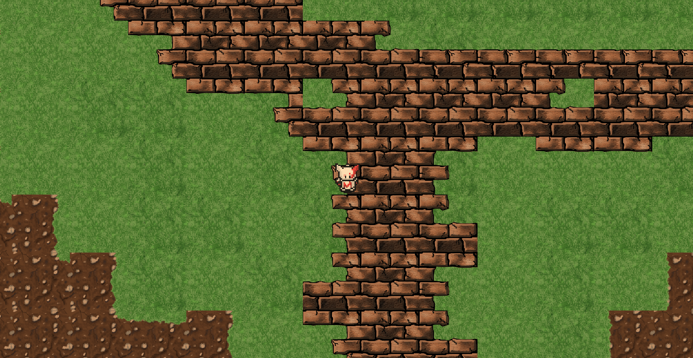

# CBA
A 2d top down Game Engine in C++. 
Note this was initially developed around 2015 when I was self-learning C++ and was worked on, on/off for the next 2 years. 

The engine is of a Component based architecture. Every entity is made of a mix of components (movement, health, texture, etc). All components are independent of each other. Operations are performed by systems. Systems only operate of entities that have required components. Entities can be declared in lua, along with their functionality when events occur. This means no recompiling is needs for game logic. Missions are created in XML.

